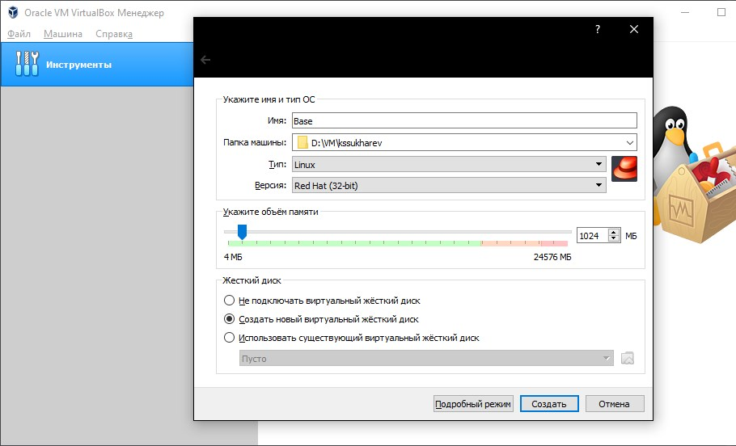
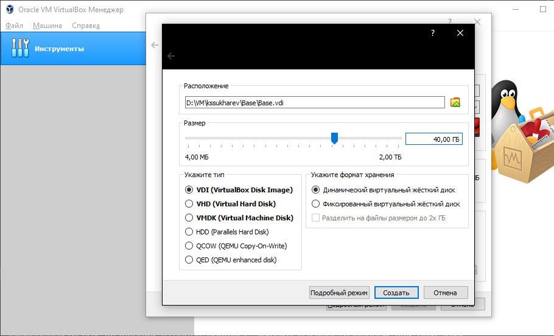
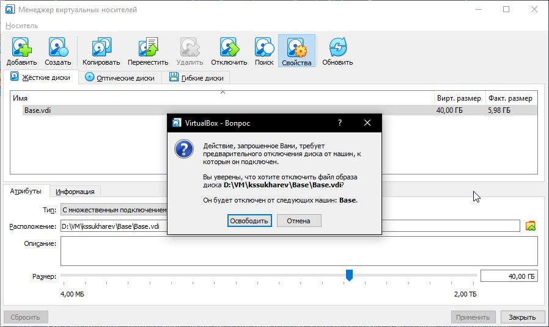

---
## Front matter
lang: ru-RU
title: "Отчет по лабораторной работе № 1"
subtitle: "Установка и конфигурация операционной системы на виртуальную машину"
author: "Сухарев Кирилл"

## Formatting
toc: false
slide_level: 2
theme: metropolis
header-includes: 
 - \metroset{progressbar=frametitle,sectionpage=progressbar,numbering=fraction}
 - '\makeatletter'
 - '\beamer@ignorenonframefalse'
 - '\makeatother'
aspectratio: 43
section-titles: true
---

# Цель работы

Приобретение практических навыков установки операционной системы на виртуальную машину, настройки минимально необходимых для дальнейшей работы сервисов.

# Создание виртуальной машины

{ #fig:002 width=100% }

# Создание виртуального жесткого диска

{ #fig:003 width=100% }

# Обновление ситемных файлов

{ #fig:012 width=100% }

# Установка mc

{ #fig:013 width=100% }

# Настройка виртуального диска для множественного подключения

{ #fig:014 width=100% }

# Создание еще одной виртуальной машины

{ #fig:015 width=100% }
 
# Выводы

При использовании виртуального жесткого диска в качестве диска с множественным подключением можно использовать этот диск сразу на нескольких виртуальных машинах.