---
# Front matter
lang: ru-RU
title: "Лабораторная работа № 1"
subtitle: "Установка и конфигурация операционной системы на виртуальную машину"
author: "Сухарев Кирилл"

# Formatting
toc-title: "Содержание"
toc: true
toc_depth: 2
lof: true
lot: true
fontsize: 12pt
linestretch: 1.5
papersize: a4paper
documentclass: scrreprt
polyglossia-lang: russian
polyglossia-otherlangs: english
mainfont: PT Serif
romanfont: PT Serif
sansfont: PT Sans
monofont: PT Mono
mainfontoptions: Ligatures=TeX
romanfontoptions: Ligatures=TeX
sansfontoptions: Ligatures=TeX,Scale=MatchLowercase
monofontoptions: Scale=MatchLowercase
indent: true
pdf-engine: lualatex
header-includes:
  - \linepenalty=10
  - \interlinepenalty=0
  - \hyphenpenalty=50
  - \exhyphenpenalty=50
  - \binoppenalty=700
  - \relpenalty=500
  - \clubpenalty=150
  - \widowpenalty=150
  - \displaywidowpenalty=50
  - \brokenpenalty=100
  - \predisplaypenalty=10000
  - \postdisplaypenalty=0
  - \floatingpenalty = 20000
  - \usepackage{float}
  - \floatplacement{figure}{H}
---

# Цель работы

Приобретение практических навыков установки операционной системы на виртуальную машину, настройки минимально необходимых для дальнейшей работы сервисов.

# Выполнение работы

1. Выберем на вкладке **Общие** меню **Файл -> Настройки**. Установим каталог для виртуальных машин в папке D:/VM/kssukharev (@fig:001)

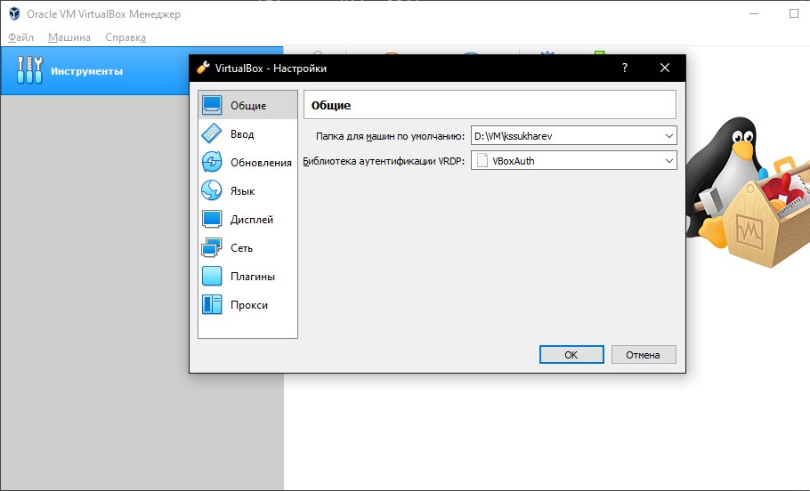{ #fig:001 width=100% }

2. На вкладке **Машина** выберем **Создать** и создадим новую виртуальную машину со следующими характеристиками: Имя - "Base", тип операционной системы - Linux, RedHat. Размер основной памяти - 1024 МБ, также создадим новый виртуальный жесткий диск. (@fig:002)

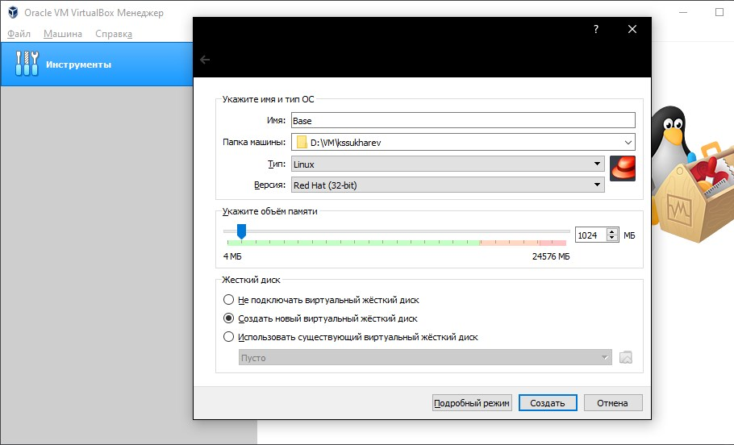{ #fig:002 width=100% }

3. Укажем размер жесткого диска - 40 ГБ, формат хранения - динамический, а также его тип - VDI. (@fig:003)

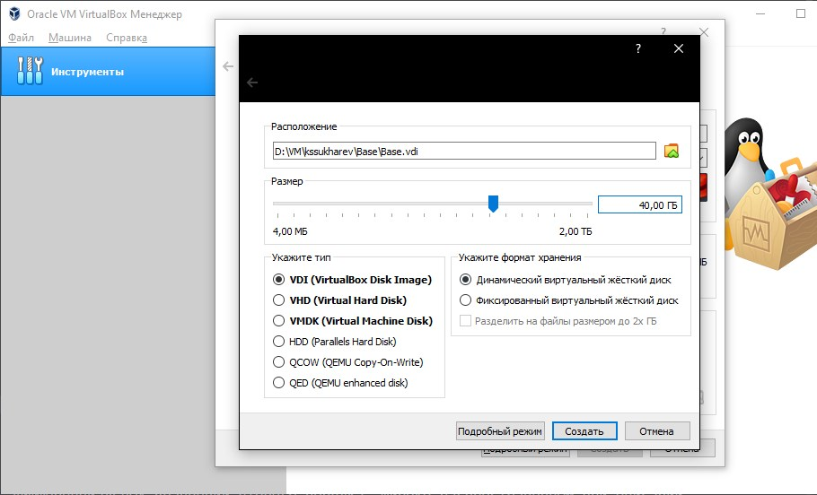{ #fig:003 width=100% }

4. В свойствах созданной виртуальной машины убедимся, что установлено корректный каталог для снимков виртуальной машины. (@fig:004)

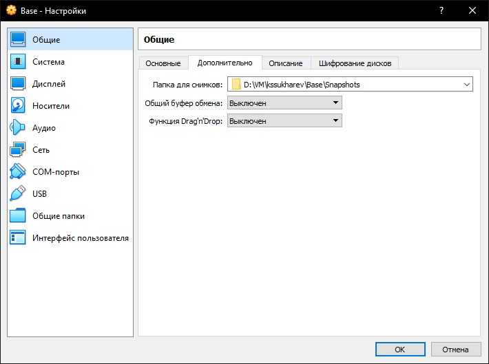{ #fig:004 width=100% }

5. Перейдем на вкладку **Носители** и добавим новый привод оптических дисков с образом CentOS-7. (@fig:005)

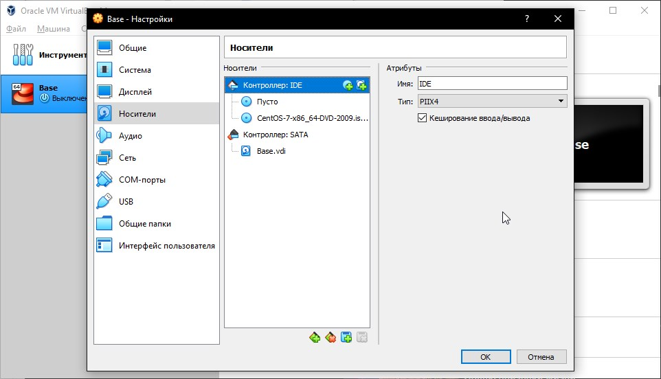{ #fig:005 width=100% }

6. Запустим виртуальную машину, выберем установку системы на жесткий диск. При выборе языка установим русский язык для интерфейса. (@fig:006)

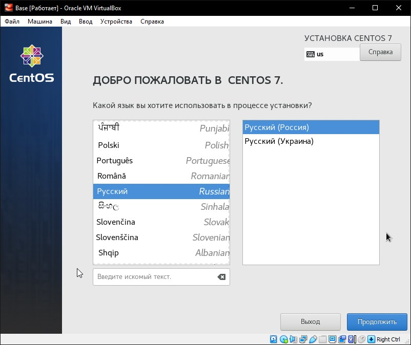{ #fig:006 width=100% }

7. В качестве имени узла сети укажем kssukharev.localdomain. (@fig:007)

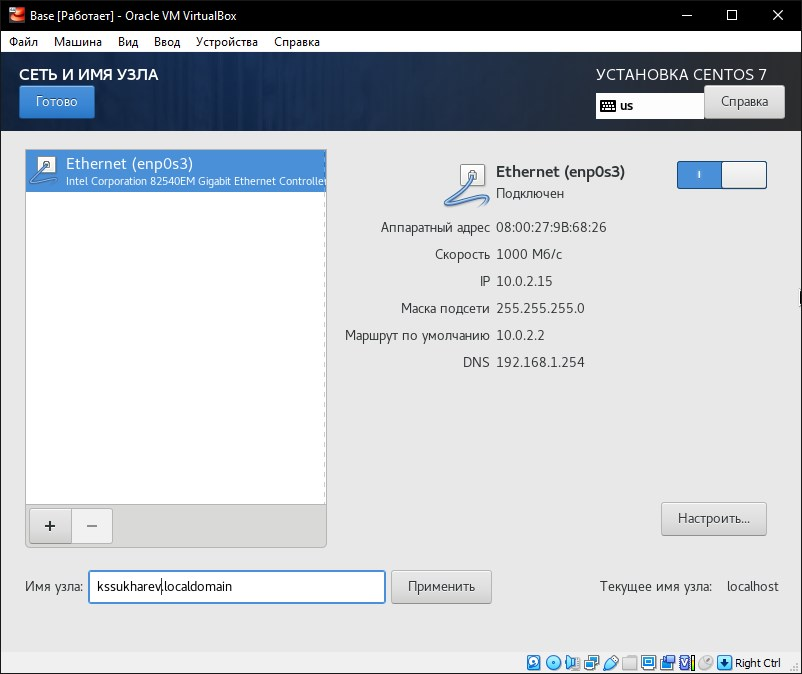{ #fig:007 width=100% }

8. Выберем для установки сервер с GUI, а также средства разработки. (@fig:008)

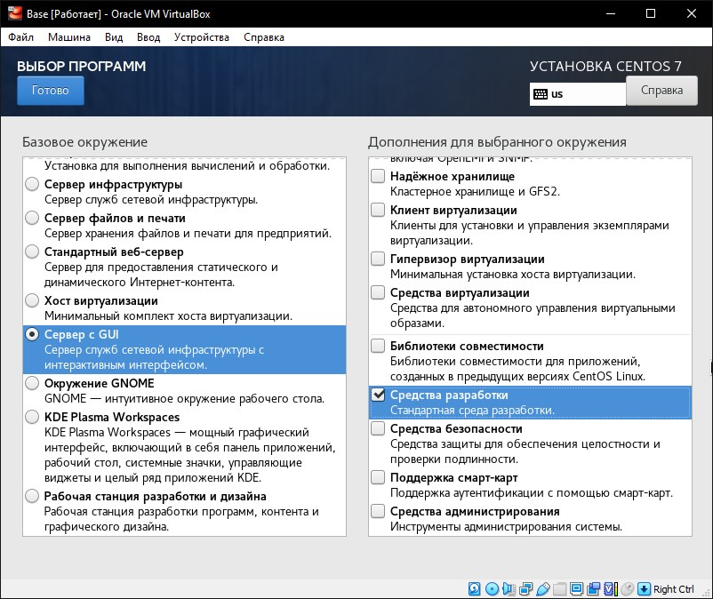{ #fig:008 width=100% }

9. Пока идет установка, зададим Root-пароль, а также создадим пользователя kssukharev. (@fig:009)

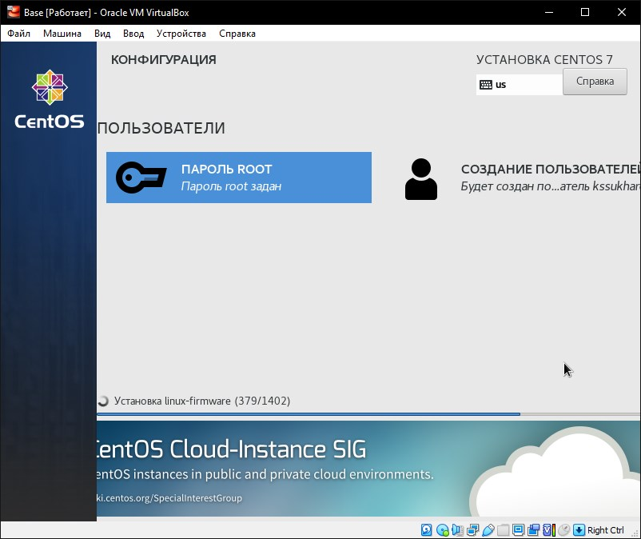{ #fig:009 width=100% }

10. Примем лицензионное соглашение. (@fig:010)

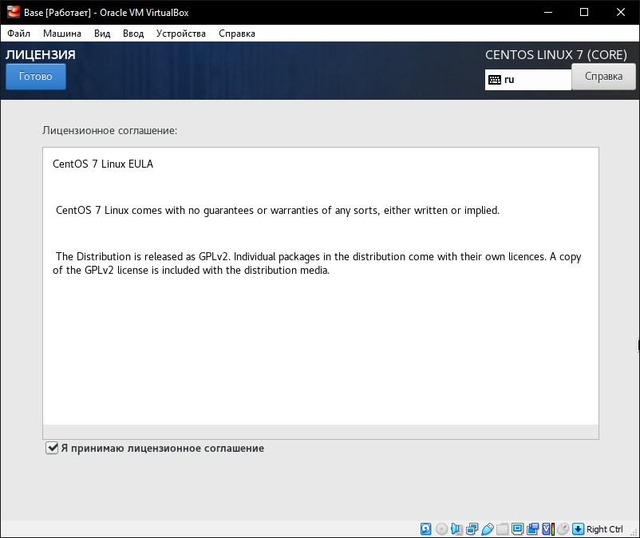{ #fig:010 width=100% }

11. Подключимся к виртуальной машины при помощи созданной учетной записи. (@fig:011)

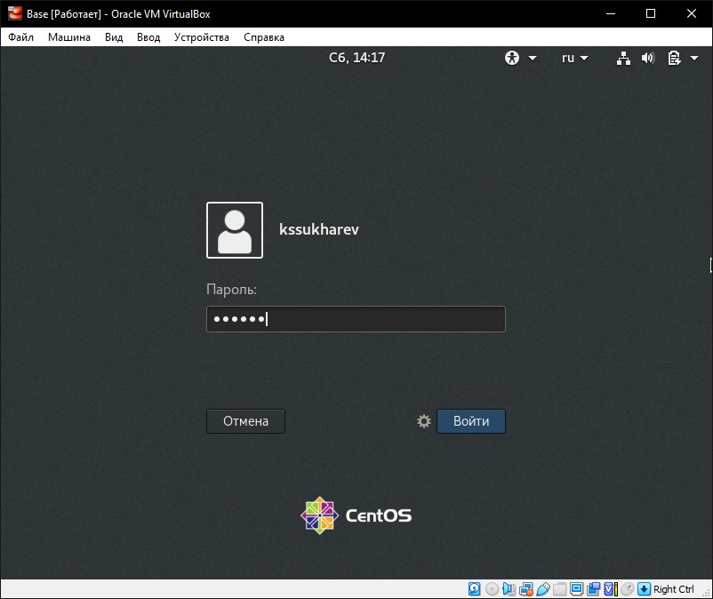{ #fig:011 width=100% }

12. При помощи команды su перейдем в учетную запись **root** и командой yum update обновим системные файлы. (@fig:012)

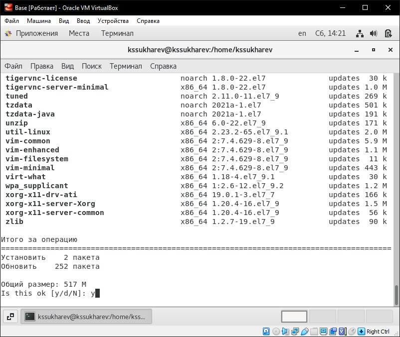{ #fig:012 width=100% }

13. Командой yum install mc установим **mc**. (@fig:013)

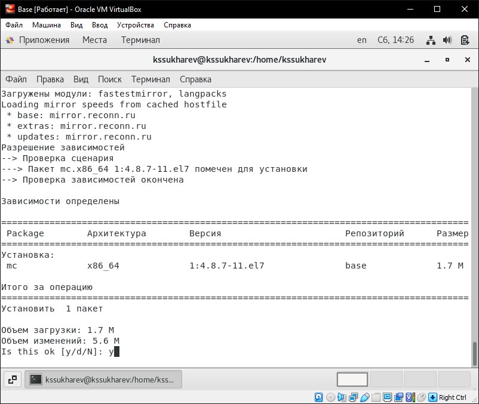{ #fig:013 width=100% }

14. Теперь можно завершить работу виртуальной машины. Осталось сделать так, чтобы другие виртуальные машины могли использовать эту как базовую. Для этого в VirtualBox выберем меню **Файл -> Менеджер виртуальных носителей -> Жесткие диски** и в свойствах "Base.vdi" указать тип *С множественным подключением*, согласившись освободить данный диск. (@fig:014)

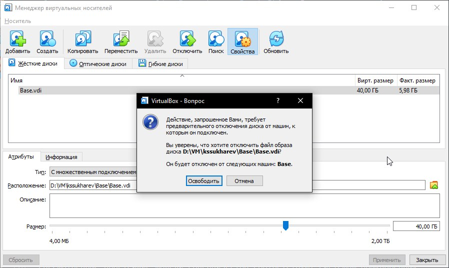{ #fig:014 width=100% }

15. Теперь создадим новую виртуальную машину на основе Base. Для этого в настройках новой виртуальной машины будем использовать уже существующий жествкий диск "Base.vdi". (@fig:015)

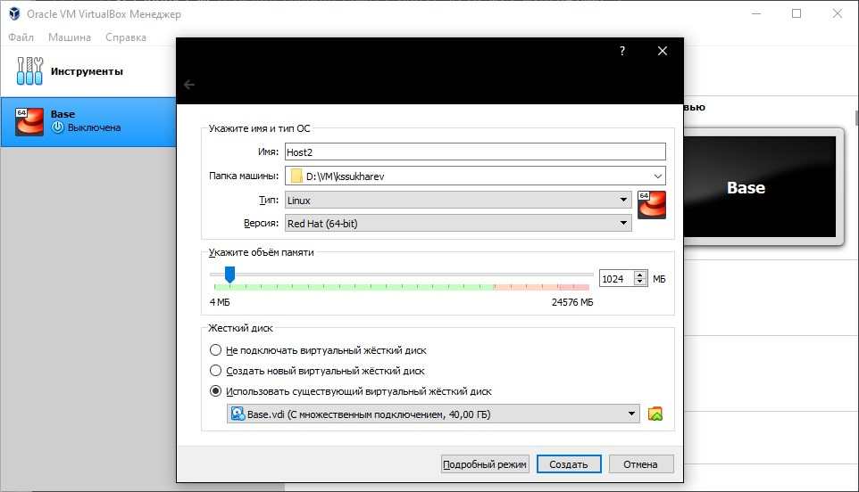{ #fig:015 width=100% }
 
# Выводы

При использовании виртуального жесткого диска в качестве диска с множественным подключением можно использовать этот диск сразу на нескольких виртуальных машинах.