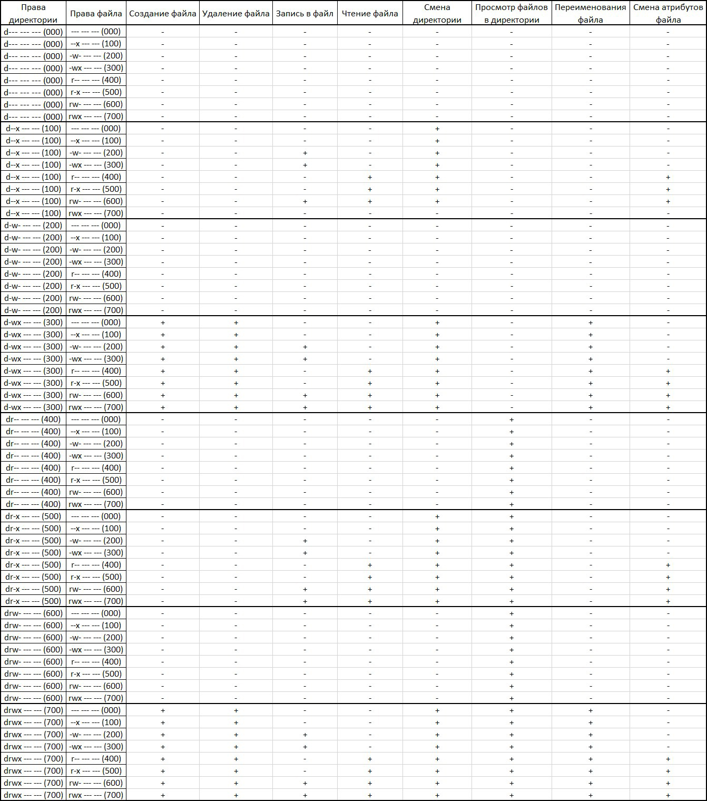
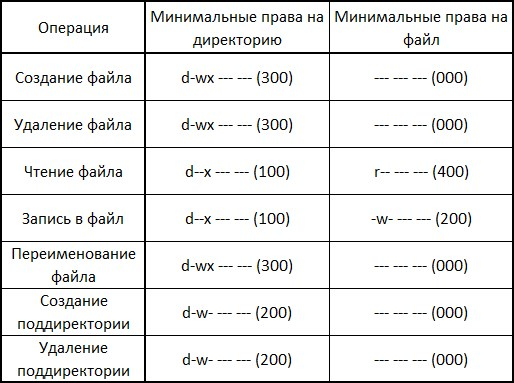

---
## Front matter
lang: ru-RU
title: "Отчет по лабораторной работе № 2"
subtitle: "Дискреционное разграничение прав в Linux. Основные атрибуты"
author: "Сухарев Кирилл"

## Formatting
toc: false
slide_level: 2
theme: metropolis
header-includes: 
 - \metroset{progressbar=frametitle,sectionpage=progressbar,numbering=fraction}
 - '\makeatletter'
 - '\beamer@ignorenonframefalse'
 - '\makeatother'
aspectratio: 43
section-titles: true
---

# Цель работы

Получение практических навыков работы в консоли с атрибутами файлов, закрепление теоретических основ дискреционного разграничения доступа в современных системах с открытым кодом на базе ОС Linux.

# Задачи выполнения работы

- Исследовать права доступа к файлам

- Исследовать права доступа к каталогам

- Определить минимальные права для совершения различных операций над файлами и каталогами.

# Создание нового пользователя

{ #fig:001 width=100% }

# Составление таблицы «Установленные права и разрешённые действия»

{ #fig:012 width=50% }

# Создание таблицы «Минимальные права для совершения операций»

{ #fig:013 width=100% }
 
# Выводы

Права доступа используются для управления возможностями различных групп пользователей системы по отношению к директориям и файлам.