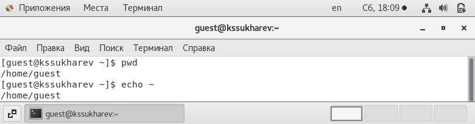
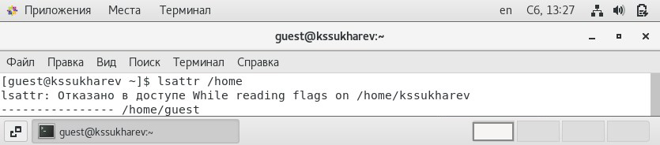

---
# Front matter
lang: ru-RU
title: "Лабораторная работа № 2"
subtitle: "Дискреционное разграничение прав в Linux. Основные атрибуты"
author: "Сухарев Кирилл"

# Formatting
toc-title: "Содержание"
toc: true
toc_depth: 2
lof: true
lot: true
fontsize: 12pt
linestretch: 1.5
papersize: a4paper
documentclass: scrreprt
polyglossia-lang: russian
polyglossia-otherlangs: english
mainfont: PT Serif
romanfont: PT Serif
sansfont: PT Sans
monofont: PT Mono
mainfontoptions: Ligatures=TeX
romanfontoptions: Ligatures=TeX
sansfontoptions: Ligatures=TeX,Scale=MatchLowercase
monofontoptions: Scale=MatchLowercase
indent: true
pdf-engine: lualatex
header-includes:
  - \linepenalty=10
  - \interlinepenalty=0
  - \hyphenpenalty=50
  - \exhyphenpenalty=50
  - \binoppenalty=700
  - \relpenalty=500
  - \clubpenalty=150
  - \widowpenalty=150
  - \displaywidowpenalty=50
  - \brokenpenalty=100
  - \predisplaypenalty=10000
  - \postdisplaypenalty=0
  - \floatingpenalty = 20000
  - \usepackage{float}
  - \floatplacement{figure}{H}
---

# Цель работы

Получение практических навыков работы в консоли с атрибутами файлов, закрепление теоретических основ дискреционного разграничения доступа в современных системах с открытым кодом на базе ОС Linux.

# Условные обозначения и термины

**Учетная запись** - хранимая в компьютерной системе совокупность данных о пользователе, необходимая для его опознавания (аутентификации) и предоставления доступа к его личным данным и настройкам.

**Директория** - объект в файловой системе, упрощающий организацию файлов.

**uid** - номер, назначенный каждому пользователю Linux. Это представление пользователя в ядре Linux.

**gid** - идентификационный номер основной группы пользователя.

# Теоретические вводные данные

## Права доступа к файлам в Linux

В операционной системе Linux  много функций безопасности. Одна из самых важных - это система прав доступа к файлам. Linux, как последователь идеологии ядра Linux в отличие от Windows, изначально проектировался как многопользовательская система, поэтому права доступа к файлам в linux продуманы очень хорошо. 

## Основные права доступа к файлам в Linux

Изначально каждый файл имел три параметра доступа. Вот они:

- Чтение - разрешает получать содержимое файла, но на запись нет. Для каталога позволяет получить список файлов и каталогов, расположенных в нем;
- Запись - разрешает записывать новые данные в файл или изменять существующие, а также позволяет создавать и изменять файлы и каталоги;
- Выполнение - вы не можете выполнить программу, если у нее нет флага выполнения. Этот атрибут устанавливается для всех программ и скриптов, именно с помощью него система может понять, что этот файл нужно запускать как программу.

Но все эти права были бы бессмысленными, если бы применялись сразу для всех пользователей. Поэтому каждый файл имеет три категории пользователей, для которых можно устанавливать различные сочетания прав доступа:

- Владелец - набор прав для владельца файла, пользователя, который его создал или сейчас установлен его владельцем. Обычно владелец имеет все права, чтение, запись и выполнение.
- Группа - любая группа пользователей, существующая в системе и привязанная к файлу. Но это может быть только одна группа и обычно это группа владельца, хотя для файла можно назначить и другую группу.
- Остальные - все пользователи, кроме владельца и пользователей, входящих в группу файла.

Именно с помощью этих наборов полномочий устанавливаются права файлов в linux. Каждый пользователь может получить полный доступ только к файлам, владельцем которых он является или к тем, доступ к которым ему разрешен. Только пользователь Root может работать со всеми файлами независимо от их набора их полномочий.

## Просмотр прав доступа

Узнать права на файл linux можно командой **ls -l**. За права файлов в linux тут отвечают черточки. Первая это тип файла, который рассмотрен в отдельной статье. Дальше же идут группы прав сначала для владельца, для группы и для всех остальных. Всего девять черточек на права и одна на тип. Рассмотрим значения черточек:

- --- - нет прав, совсем;
- --x - разрешено только выполнение файла, как программы но не изменение и не чтение;
- -w- - разрешена только запись и изменение файла;
- -wx - разрешено изменение и выполнение, но в случае с каталогом, вы не можете посмотреть его содержимое;
- r-- - права только на чтение;
- r-x - только чтение и выполнение, без права на запись;
- rw- - права на чтение и запись, но без выполнения;
- rwx - все права;

# Техническое оснащение и выбранные методы проведения работы

В качестве среды выполнения лабораторной работы используется менеджер виртуальных машин VirtualBox и установленная с его помощью OC Centos 7 на базе Linux.

# Выполнение работы

1. Используя учётную запись администратора создадим учётную запись пользователя guest и зададим для него пароль (@fig:001).

{ #fig:001 width=100% }

2. Войдем в систему под пользователям guest (@fig:002).

{ #fig:002 width=100% }

3. Определим текущую директорию командой **pwd** и сравним ее с домашней директорией, которая выводится командой **echo ~**. Текущая директория является домашней (@fig:003).

{ #fig:003 width=100% }

4. Командой **whoami** уточним имя пользователя. Команда вывела guest (@fig:004).

{ #fig:004 width=100% }

5. Теперь узнаем более подробные сведения о пользователе командой **id**. uid - 1001, gid - 1001. Сравним вывод с выводом команды **groups**. Команда вывела список всех групп, но поскольку новых групп не создавалось, команда вывела только guest. Вывод команды **id** полностью соответствует приглашению командной строки (@fig:005).

{ #fig:005 width=100% }

6. Просмотрим сведения о пользователе guest в файле */etc/passwd* командой **cat /etc/passwd | grep guest**. Выведенные uid и gid совпадают с определенными ранее (@fig:006).

{ #fig:006 width=100% }

7. Определим существующие в системе директории командой **ls -R /home/**. Доступ к поддиректориям kssukharev получить не удалось. Выведем расширенную информацию о директориях командой **ls -l /home/**. Видим, что у владельцев есть полный доступ к каталогам. У остальных же пользователей доступа нет совсем (@fig:007).

{ #fig:007 width=100% }

8. Проверим атрибуты на поддиректориях в директории */home* командой **lsattr /home**. Нам удалось увидеть атрибуты лишь на директории guest (@fig:008).

{ #fig:008 width=100% }

9. Создадим в домашней директории поддиректорию dir1 командой **mkdir dir1**. Снова применим команды **ls -l** и **lsattr** чтобы увидеть, какие права доступа и расширенные атрибуты были выставлены на директорию dir1. Права доступа предоставлены пользователю guest и группе guest в полном размере, а остальным пользователям - только на чтение и выполнение. Каких-либо атрибутов на этой директории нет (@fig:009).

{ #fig:009 width=100% }

10. Снимем с созданной директории все права командой **chmod 000 dir1**. Командой **ls -l** убедимся в правильноси выполненных действий (@fig:010).

{ #fig:010 width=100% }

11. Попытаемся созадать в директории dir1 файл file1 командой **echo "test" > /home/guest/dir1/file1**. Получаем закономерную ошибку, поскольку мы запретили любые взаимодействия с директорией (@fig:011).

{ #fig:011 width=100% }

12. Заполним таблицу «Установленные права и разрешённые действия» (@fig:012). До заполнения таблицы создадим в dir1 файл file1. При заполнении таблицы будем использовать следующие команды:

- Создание файла: **echo "test" > dir1/file2**

- Удаление файла: **rm dir1/file1**

- Запись в файл: **echo "test" > dir1/file1**

- Чтение файла: **cat dir1/file1**

- Смена директории: **cd dir1**

- Просмотр файлов в директории: **ls dir1**

- Переименование файла: **mv dir1/file1 dir1/file2**

- Смена атрибутов файла: **chattr +d dir1/file1**

Процесс заполнения таблицы подробно описан в скринкасте к данной лабораторной работе.

{ #fig:012 width=100% }

13. По результатам таблицы «Установленные права и разрешённые действия» заполним таблицу «Минимальные права для совершения операций» (@fig:013).

{ #fig:013 width=100% }

# Выводы

Права доступа используются для управления возможностями различных групп пользователей системы по отношению к директориям и файлам.