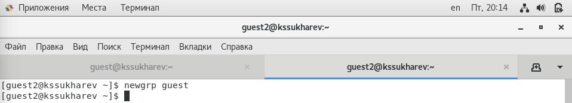

---
# Front matter
lang: ru-RU
title: "Лабораторная работа № 3"
subtitle: "Дискреционное разграничение прав в Linux. Два пользователя"
author: "Сухарев Кирилл"

# Formatting
toc-title: "Содержание"
toc: true
toc_depth: 2
lof: true
lot: true
fontsize: 12pt
linestretch: 1.5
papersize: a4paper
documentclass: scrreprt
polyglossia-lang: russian
polyglossia-otherlangs: english
mainfont: PT Serif
romanfont: PT Serif
sansfont: PT Sans
monofont: PT Mono
mainfontoptions: Ligatures=TeX
romanfontoptions: Ligatures=TeX
sansfontoptions: Ligatures=TeX,Scale=MatchLowercase
monofontoptions: Scale=MatchLowercase
indent: true
pdf-engine: lualatex
header-includes:
  - \linepenalty=10
  - \interlinepenalty=0
  - \hyphenpenalty=50
  - \exhyphenpenalty=50
  - \binoppenalty=700
  - \relpenalty=500
  - \clubpenalty=150
  - \widowpenalty=150
  - \displaywidowpenalty=50
  - \brokenpenalty=100
  - \predisplaypenalty=10000
  - \postdisplaypenalty=0
  - \floatingpenalty = 20000
  - \usepackage{float}
  - \floatplacement{figure}{H}
---

# Цель работы

Получение практических навыков работы в консоли с атрибутами файлов для групп пользователей.

# Условные обозначения и термины

**Учетная запись** - хранимая в компьютерной системе совокупность данных о пользователе, необходимая для его опознавания (аутентификации) и предоставления доступа к его личным данным и настройкам.

**Директория** - объект в файловой системе, упрощающий организацию файлов.

**uid** - номер, назначенный каждому пользователю Linux. Это представление пользователя в ядре Linux.

**gid** - идентификационный номер основной группы пользователя.

# Теоретические вводные данные

## Права доступа к файлам в Linux

В операционной системе Linux  много функций безопасности. Одна из самых важных - это система прав доступа к файлам. Linux, как последователь идеологии ядра Linux в отличие от Windows, изначально проектировался как многопользовательская система, поэтому права доступа к файлам в linux продуманы очень хорошо. 

## Основные права доступа к файлам в Linux

Изначально каждый файл имел три параметра доступа. Вот они:

- Чтение - разрешает получать содержимое файла, но на запись нет. Для каталога позволяет получить список файлов и каталогов, расположенных в нем;
- Запись - разрешает записывать новые данные в файл или изменять существующие, а также позволяет создавать и изменять файлы и каталоги;
- Выполнение - вы не можете выполнить программу, если у нее нет флага выполнения. Этот атрибут устанавливается для всех программ и скриптов, именно с помощью него система может понять, что этот файл нужно запускать как программу.

Но все эти права были бы бессмысленными, если бы применялись сразу для всех пользователей. Поэтому каждый файл имеет три категории пользователей, для которых можно устанавливать различные сочетания прав доступа:

- Владелец - набор прав для владельца файла, пользователя, который его создал или сейчас установлен его владельцем. Обычно владелец имеет все права, чтение, запись и выполнение.
- Группа - любая группа пользователей, существующая в системе и привязанная к файлу. Но это может быть только одна группа и обычно это группа владельца, хотя для файла можно назначить и другую группу.
- Остальные - все пользователи, кроме владельца и пользователей, входящих в группу файла.

Именно с помощью этих наборов полномочий устанавливаются права файлов в linux. Каждый пользователь может получить полный доступ только к файлам, владельцем которых он является или к тем, доступ к которым ему разрешен. Только пользователь Root может работать со всеми файлами независимо от их набора их полномочий.

## Просмотр прав доступа

Узнать права на файл linux можно командой **ls -l**. За права файлов в linux тут отвечают черточки. Первая это тип файла, который рассмотрен в отдельной статье. Дальше же идут группы прав сначала для владельца, для группы и для всех остальных. Всего девять черточек на права и одна на тип. Рассмотрим значения черточек:

- --- - нет прав, совсем;
- --x - разрешено только выполнение файла, как программы но не изменение и не чтение;
- -w- - разрешена только запись и изменение файла;
- -wx - разрешено изменение и выполнение, но в случае с каталогом, вы не можете посмотреть его содержимое;
- r-- - права только на чтение;
- r-x - только чтение и выполнение, без права на запись;
- rw- - права на чтение и запись, но без выполнения;
- rwx - все права;

# Техническое оснащение и выбранные методы проведения работы

В качестве среды выполнения лабораторной работы используется менеджер виртуальных машин VirtualBox и установленная с его помощью OC Centos 7 на базе Linux.

# Выполнение работы

1. Используя учётную запись администратора создадим учётную запись пользователя guest2, зададим для него пароль и добавим его в группу guest (@fig:001).

{ #fig:001 width=100% }

2. Войдем в систему от двух пользователях на двух разных консолях и при помощи команды **pwd** определим директорию. (@fig:002).

{ #fig:002 width=100% }

3. Выполним команды **groups guest** и **groups guest2** (@fig:003), чтобы определить, в какие группы входят указанные пользователи. Сравним вывод этих команд с выводом команды **id -Gn** и **id -G** (@fig:004). Обе команды сообщают, что пользователь guest находится только в группе guest, а пользователь guest2 - в группах guest и guest2.

{ #fig:003 width=100% }

{ #fig:004 width=100% }

4. Просмотрим файл */etc/group*. В нем содержится список групп, а также список пользователей внутри этой группы. (@fig:005).

{ #fig:005 width=100% }

5. От имени пользователя guest2 выполним регистрацию этого пользователя в групе guest командой **newgrp guest**(@fig:006).

{ #fig:006 width=100% }

6. От имени пользователя guest изменим права директории */home/guest*, разрешив все действия для пользователей группы (@fig:007).

{ #fig:007 width=100% }

7. Выполним анализ прав доступа на директорию dir1 и файла file1. Менять права будем от имени пользователя guest, а выполнять проверку - от пользователя guest2. Результаты будем заносить в табл. 3.1 (@fig:008). Для провери будут использоваться следующие команды:

- Создание файла: **echo "test" > dir1/file2**

- Удаление файла: **rm dir1/file1**

- Запись в файл: **echo "test" > dir1/file1**

- Чтение файла: **cat dir1/file1**

- Смена директории: **cd dir1**

- Просмотр файлов в директории: **ls dir1**

- Переименование файла: **mv dir1/file1 dir1/file2**

- Смена атрибутов файла: **chattr +d dir1/file1**

{ #fig:008 width=100% }

8. По результатам таблицы 3.1 заполним таблицу 3.2 (@fig:009).

{ #fig:009 width=100% }

# Выводы

Права доступа используются для управления возможностями различных групп пользователей системы по отношению к директориям и файлам.

# Библиография

1. Группы пользователей Linux // Losst. 2020. URL: https://losst.ru/gruppy-polzovatelej-linux (Дата обращения: 15.10.2021).

2. Права доступа к файлам в Linux. // Losst. 2020. URL: https://losst.ru/prava-dostupa-k-fajlam-v-linux (Дата обращения: 15.10.2021).

3. Д. С. Кулябов, А. В. Королькова, М. Н. Геворкян. Информационная безопасность компьютерных сетей: лабораторные работы. // Факультет физико-математических и естественных наук. M.: РУДН, 2015. 64 с..