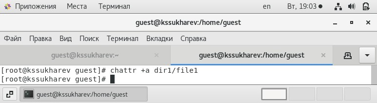
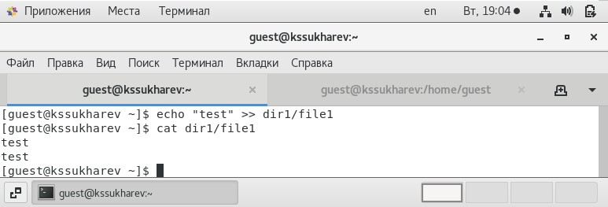
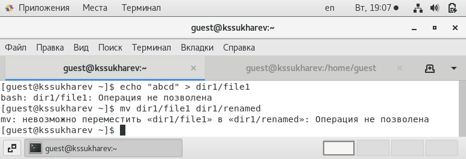
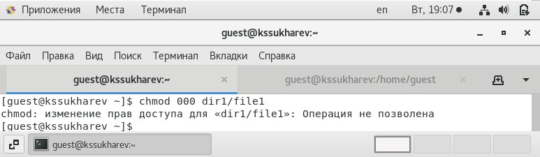
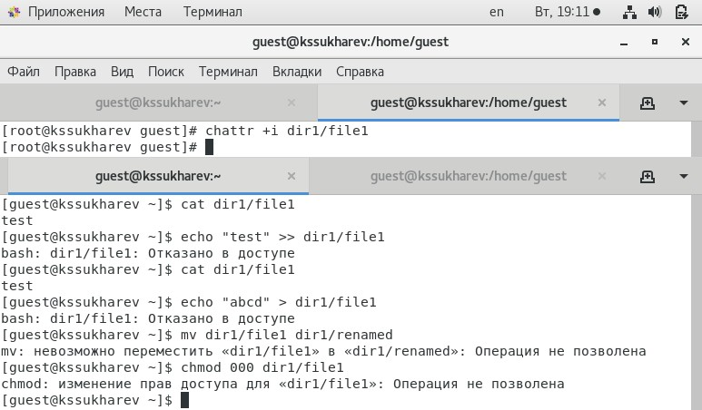

---
## Front matter
lang: ru-RU
title: "Отчет по лабораторной работе № 4"
subtitle: "Дискреционное разграничение прав в Linux. Расширенные атрибуты"
author: "Сухарев Кирилл"

## Formatting
toc: false
slide_level: 2
theme: metropolis
header-includes: 
 - \metroset{progressbar=frametitle,sectionpage=progressbar,numbering=fraction}
 - '\makeatletter'
 - '\beamer@ignorenonframefalse'
 - '\makeatother'
aspectratio: 43
section-titles: true
---

# Цель работы

Получение практических навыков работы в консоли с расширенными атрибутами файлов.

# Задачи выполнения работы

- Научиться работать с расширенными атрибутами

- Исследовать атрибут **a**

- Исследовать атрибут **i**

# Установка атрибута **a**

{ #fig:004 width=100% }

# Дозапись в файл

{ #fig:006 width=100% }

# Перезапись и переименование файла

{ #fig:007 width=100% }

# Смена прав

{ #fig:008 width=100% }

# Атрибут **i**

{ #fig:010 width=100% }
 
# Выводы

Расширенные атрибуты облегчают работу с правами доступа.