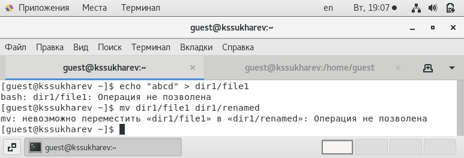
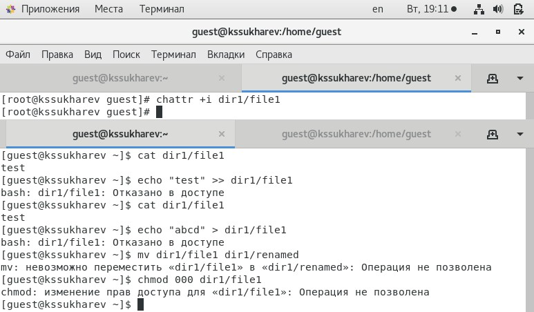

---
# Front matter
lang: ru-RU
title: "Лабораторная работа № 4"
subtitle: "Дискреционное разграничение прав в Linux. Расширенные атрибуты"
author: "Сухарев Кирилл"

# Formatting
toc-title: "Содержание"
toc: true
toc_depth: 2
lof: true
lot: true
fontsize: 12pt
linestretch: 1.5
papersize: a4paper
documentclass: scrreprt
polyglossia-lang: russian
polyglossia-otherlangs: english
mainfont: PT Serif
romanfont: PT Serif
sansfont: PT Sans
monofont: PT Mono
mainfontoptions: Ligatures=TeX
romanfontoptions: Ligatures=TeX
sansfontoptions: Ligatures=TeX,Scale=MatchLowercase
monofontoptions: Scale=MatchLowercase
indent: true
pdf-engine: lualatex
header-includes:
  - \linepenalty=10
  - \interlinepenalty=0
  - \hyphenpenalty=50
  - \exhyphenpenalty=50
  - \binoppenalty=700
  - \relpenalty=500
  - \clubpenalty=150
  - \widowpenalty=150
  - \displaywidowpenalty=50
  - \brokenpenalty=100
  - \predisplaypenalty=10000
  - \postdisplaypenalty=0
  - \floatingpenalty = 20000
  - \usepackage{float}
  - \floatplacement{figure}{H}
---

# Цель работы

Получение практических навыков работы в консоли с расширенными атрибутами файлов.

# Условные обозначения и термины

**Утилита** -  сервисная программа, облегчающая пользование другими программами, работу с компьютером.

**Учетная запись** - хранимая в компьютерной системе совокупность данных о пользователе, необходимая для его опознавания (аутентификации) и предоставления доступа к его личным данным и настройкам.

**Директория** - объект в файловой системе, упрощающий организацию файлов.

# Теоретические вводные данные

Утилиты chattr и lsattr входят в пакет e2fsprogs и предустановлены во всех современных дистрибутивах. Базовый синтаксис chattr выглядит следующим образом:

**chattr опции [оператор][атрибуты] файлы**

Вот основные опции утилиты, которые вы можете использовать:

- -R - рекурсивная обработка каталога;

- -V - максимально подробный вывод;

- -f - игнорировать сообщения об ошибках;

- -v - вывести версию.

Оператор может принимать значения:

- "+" - включить выбранные атрибуты;

- "-" - отключить выбранные атрибуты;

- "=" - оставить значение атрибута таким, каким оно было у файла.

Вот некоторые доступные атрибуты:

- "a" - файл может быть открыт только в режиме добавления;

- "A" - не обновлять время перезаписи;

- "c" - автоматически сжимать при записи на диск;

- "C" - отключить копирование при записи;

- "D" - работает только для папки, когда установлен, все изменения синхронно записываются на диск сразу же;

- "e" - использовать extent'ы блоков для хранения файла;

- "i" - сделать неизменяемым;

- "j" - все данные перед записью в файл будут записаны в журнал;

- "s" - безопасное удаление с последующей перезаписью нулями;

- "S" - синхронное обновление, изменения файлов с этим атрибутом будут сразу же записаны на диск;

- "t" - файлы с этим атрибутом не будут хранится в отдельных блоках;

- "u" - содержимое файлов с этим атрибутом не будет удалено при удалении самого файла и потом может быть восстановлено.

# Техническое оснащение и выбранные методы проведения работы

В качестве среды выполнения лабораторной работы используется менеджер виртуальных машин VirtualBox и установленная с его помощью OC Centos 7 на базе Linux.

# Выполнение работы

1. От имени пользователя guest просмотрим расширенные атрибуты файла /home/guest/dir1/file1 (@fig:001).

{ #fig:001 width=100% }

2. Разрешим владельцу этого файла чтение и запись. (@fig:002).

{ #fig:002 width=100% }

3. Попробуем установить на файл расширенный атрибут **a** от имени пользователя guest (@fig:003). Получим закономерную ошибку.

{ #fig:003 width=100% }

4. Теперь выполним данную команду от имени суперпользователя. (@fig:004).

{ #fig:004 width=100% }

5. От имени пользователя guest проверим, что атрибут действительно был установлен(@fig:005).

{ #fig:005 width=100% }

6. Попробуем выполнить дозапись в файл, затем проверим результат командой cat (@fig:006). Дозапись выполнилась без каких-либо проблем.

{ #fig:006 width=100% }

7. Попробуем перезаписать информацию в файле. Затем попробуем его переименовать (@fig:007). В обоих случаях возникла ошибка.

{ #fig:007 width=100% }

8. Командой chmod попробуем изменить права на файл (@fig:008). Снова получили ошибку.

{ #fig:008 width=100% }

9. От имени суперпользователя снимем расширенный атрибут **а** с файла и повторим все проделанные действия (@fig:009). В этот раз все получилось.

{ #fig:009 width=100% }

10. Теперь проделаем те же действия с расширенным атрибутом **i** (@fig:010). В этот раз нам не доступно ничего, даже дозапись в файл

{ #fig:010 width=100% }

# Выводы

Расширенные атрибуты облегчают работу с правами доступа.

# Библиография

1. Команда chattr в Linux // Losst. 2020. URL: https://losst.ru/neizmenyaemye-fajly-v-linux (Дата обращения: 19.10.2021).

3. Д. С. Кулябов, А. В. Королькова, М. Н. Геворкян. Информационная безопасность компьютерных сетей: лабораторные работы. // Факультет физико-математических и естественных наук. M.: РУДН, 2015. 64 с..