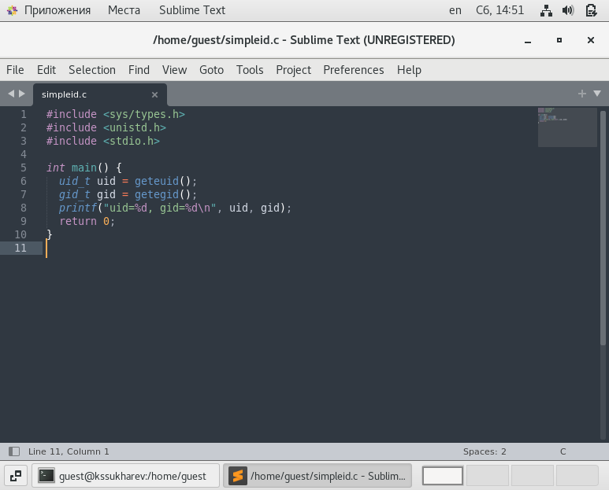
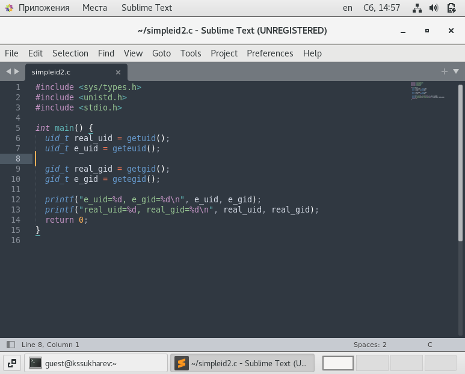
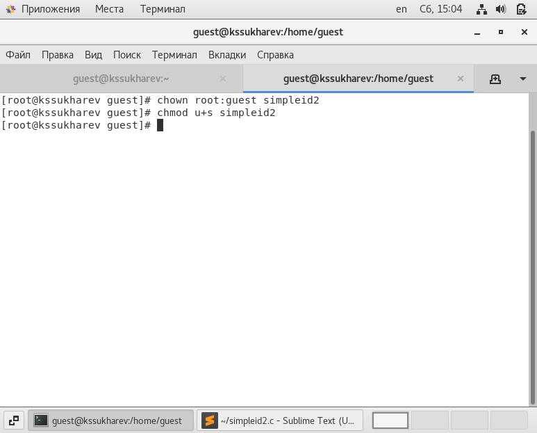
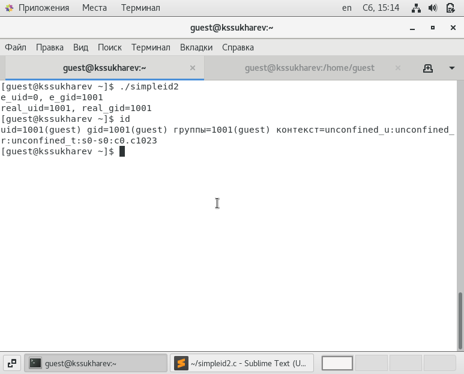
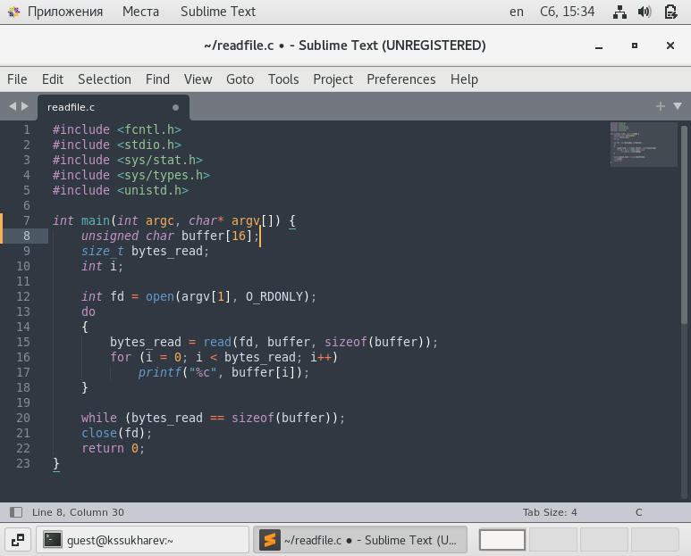
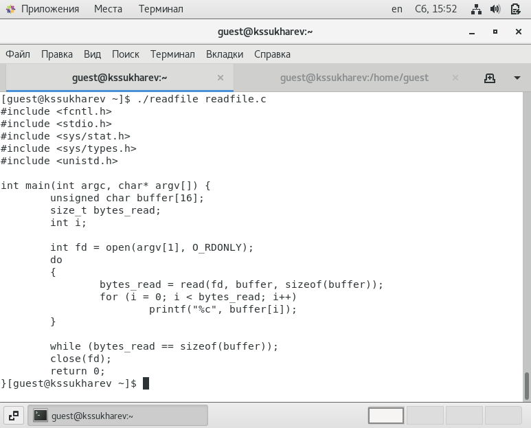
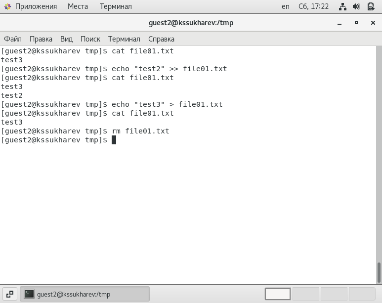

---
## Front matter
lang: ru-RU
title: "Отчет по лабораторной работе № 5"
subtitle: "Дискреционное разграничение прав в Linux. Исследование влияния дополнительных атрибутов"
author: "Сухарев Кирилл"

## Formatting
toc: false
slide_level: 2
theme: metropolis
header-includes: 
 - \metroset{progressbar=frametitle,sectionpage=progressbar,numbering=fraction}
 - '\makeatletter'
 - '\beamer@ignorenonframefalse'
 - '\makeatother'
aspectratio: 43
section-titles: true
---

# Цель работы

Изучение механизмов изменения идентификаторов, применения SetUID- и Sticky-битов. Получение практических навыков работы в консоли с дополнительными атрибутами. Рассмотрение работы механизма смены идентификатора процессов пользователей, а также влияние бита Sticky на запись и удаление файлов.

# Создание simpleid.c

{ #fig:001 width=100% }

# Создание simpleid2.c

{ #fig:003 width=100% }

# Смена владельца и группы

{ #fig:005 width=100% }

# Проверка работоспособности

{ #fig:007 width=100% }

# Создание readfile.c

{ #fig:009 width=100% }

# Проверка readfile

{ #fig:0014 width=100% }

# Работа с атрибутом Sticky

{ #fig:0024 width=100% }