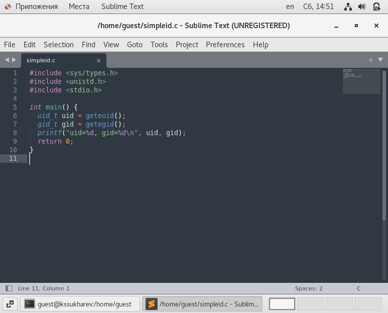
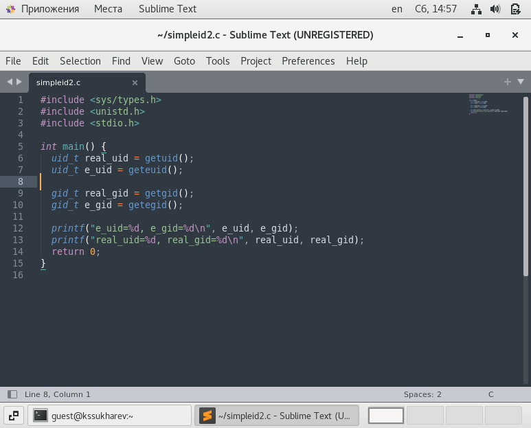
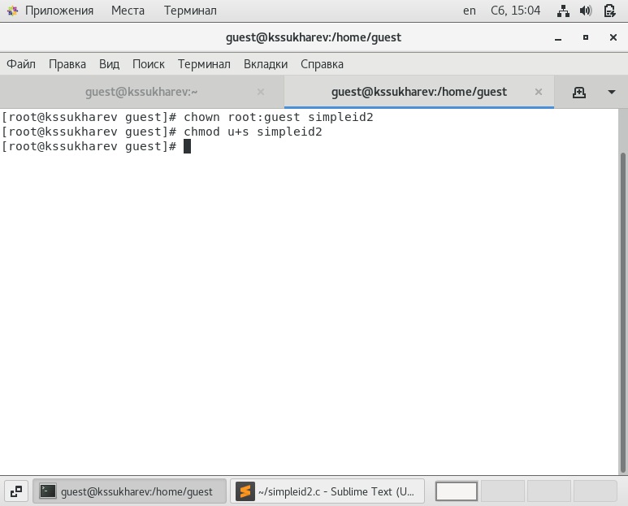
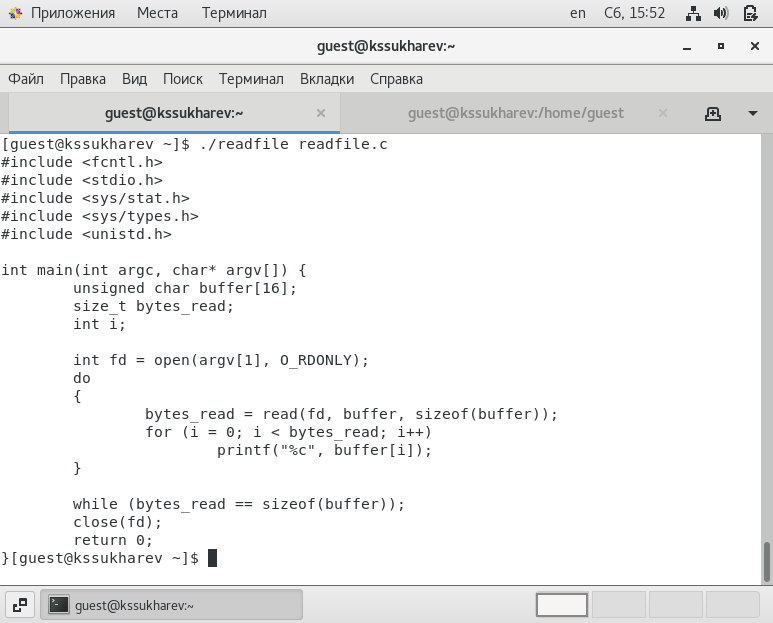
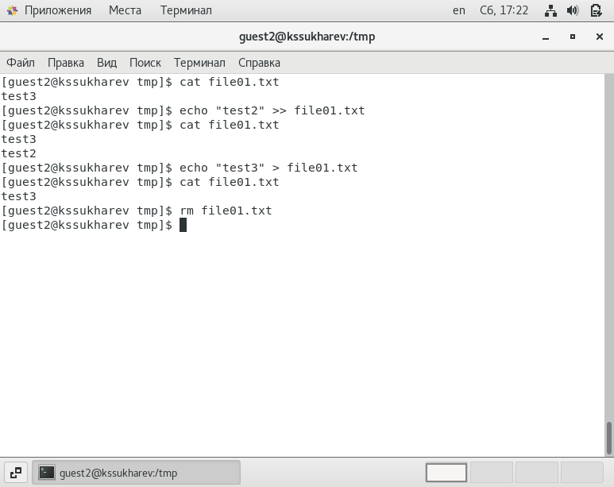
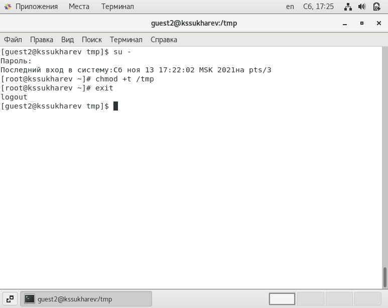

---
# Front matter
lang: ru-RU
title: "Лабораторная работа № 5"
subtitle: "Дискреционное разграничение прав в Linux. Исследование влияния дополнительных атрибутов"
author: "Сухарев Кирилл"

# Formatting
toc-title: "Содержание"
toc: true
toc_depth: 2
lof: true
lot: true
fontsize: 12pt
linestretch: 1.5
papersize: a4paper
documentclass: scrreprt
polyglossia-lang: russian
polyglossia-otherlangs: english
mainfont: PT Serif
romanfont: PT Serif
sansfont: PT Sans
monofont: PT Mono
mainfontoptions: Ligatures=TeX
romanfontoptions: Ligatures=TeX
sansfontoptions: Ligatures=TeX,Scale=MatchLowercase
monofontoptions: Scale=MatchLowercase
indent: true
pdf-engine: lualatex
header-includes:
  - \linepenalty=10
  - \interlinepenalty=0
  - \hyphenpenalty=50
  - \exhyphenpenalty=50
  - \binoppenalty=700
  - \relpenalty=500
  - \clubpenalty=150
  - \widowpenalty=150
  - \displaywidowpenalty=50
  - \brokenpenalty=100
  - \predisplaypenalty=10000
  - \postdisplaypenalty=0
  - \floatingpenalty = 20000
  - \usepackage{float}
  - \floatplacement{figure}{H}
---

# Цель работы

Изучение механизмов изменения идентификаторов, применения SetUID- и Sticky-битов. Получение практических навыков работы в консоли с дополнительными атрибутами. Рассмотрение работы механизма смены идентификатора процессов пользователей, а также влияние бита Sticky на запись и удаление файлов.

# Условные обозначения и термины

**Утилита** -  сервисная программа, облегчающая пользование другими программами, работу с компьютером.

**Учетная запись** - хранимая в компьютерной системе совокупность данных о пользователе, необходимая для его опознавания (аутентификации) и предоставления доступа к его личным данным и настройкам.

**Директория** - объект в файловой системе, упрощающий организацию файлов.

# Теоретические вводные данные

**setuid** (от англ. set user ID upon execution — «установка ID пользователя во время выполнения) являются флагами прав доступа в Unix, которые разрешают пользователям запускать исполняемые файлы с правами владельца исполняемого файла. Иногда файлы требуют разрешения на выполнение для пользователей, которые не являются членами группы владельца, в этом случае вам потребуется предоставить специальные разрешения на выполнение. Когда SUID установлен, пользователь может запускать любую программу, такую как владелец программы.

Если SUID бит установлен на файл и пользователь выполнил его, процесс будет иметь те же права что и владелец файла.

**setgid** (от англ. set group ID upon execution — «установка ID группы во время выполнения») являются флагами прав доступа в Unix, которые разрешают пользователям запускать исполняемые файлы с правами группы исполняемого файла.

Так же, как SUID, установив SGID бит для файла он устанавливает ваш идентификатор группы для группы файла в то время как файл выполняется. Это действительно полезно в случае когда у вас есть реальные установки в многопользовательском режиме где у пользователей есть доступ к файлом. В одной домашней категории я действительно не нашел использования для SGID. Но основная концепция является такой же, как и у SUID, файлы у которых SGID бит устанавливается, то они принадлежат к этой группе , а не к этому пользователю.

# Техническое оснащение и выбранные методы проведения работы

В качестве среды выполнения лабораторной работы используется менеджер виртуальных машин VirtualBox и установленная с его помощью OC Centos 7 на базе Linux.

# Выполнение работы

## Создание программы

1. Войдем в систему под пользователем guest и внесем туда программу на языке C (@fig:001).

{ #fig:001 width=100% }

2. Скомпилируем программу и выполним ее. Затем выполним программу id и убедимся, что выведенные группы соответствуют действительности (@fig:002).

{ #fig:002 width=100% }

3. Создадим файл simpleid2.c, где дополнительно будем выводить действительные идентиикаторы (@fig:003).

{ #fig:003 width=100% }

4. Скомпилируем и запустим файл simpleid2 (@fig:004).

{ #fig:004 width=100% }

5. Выполним по отношению к файлу simpleid2 команды chown и chmod. Команда chown меняет владельца и группу файла. То есть в данном случае мы устанавливаем фалу simpleid2 владельца root и группу guest. Командой chmod u+s устанавливается SetUID-бит (@fig:005).

{ #fig:005 width=100% }

6. Проверим правильность выполненных командой при помощи ls -l. Видим, что новые атрибуты и владелец файла были выполнены корректно (@fig:006).

{ #fig:006 width=100% }

7. Запустим simpleid2 и id. Видим, что real_uid и real_gid соответствуют данным id, а SetUID-бит установлен в 0 (суперпользователь) (@fig:007).

{ #fig:007 width=100% }

8. Проделаем то же самое для SetGID-бита. Для этого выполним команду chmod g+s. Снова выполним simpleid2 и убедимся, что группа файла равно 1001(guest) (@fig:008).

{ #fig:008 width=100% }

9. Создадим программу readfile.c (@fig:009).

{ #fig:009 width=100% }

10. Откомпилируем ее (@fig:010).

{ #fig:010 width=100% }

11. Изменим права у файла readfile.c так, чтобы его мог прочитать только суперпользователь (@fig:011).

{ #fig:011 width=100% }

12. Убедимся что пользователь guest не может прочитать файл readfile.c (@fig:012).

{ #fig:012 width=100% }

13. Сменим владельца программы readfile и установим SetUID-бит (@fig:013).

{ #fig:013 width=100% }

14. Попробуем прочитать файл readfile.c программой readfile. Операция была выполнена успешно (@fig:014).

{ #fig:014 width=100% }

15. Попробуем прочитать файл etc/shadow программой readfile. Снова все прошло успешно (@fig:015).

{ #fig:015 width=100% }

## Исследование Sticky-бита

1. Выясним, установлне ли атрибут Sticky на директории /tmp. По результатам выполнения команды ls -l видим, что Sticky-бит установлен (@fig:016).

{ #fig:016 width=100% }

2. Создадим в директории /tmp файл file01.txt. Посмотрим атрибуты этого файла, а затем разрешим остальным пользователям чтение и запись (@fig:017).

{ #fig:017 width=100% }

3. От имени пользователя guest2 попробуем прочитать созданный файл. Никаких ошибок не возникло (@fig:018).

{ #fig:018 width=100% }

4. Теперь попробуем дозаписать в этот файл слово test2. Как можно видеть, дозапись прошла успешно (@fig:019).

{ #fig:019 width=100% }

5. Попробуем заменить содержимое файла на "test3". Видим, что перезапись файла также прошла успешно (@fig:020).

{ #fig:020 width=100% }

6. Попробуем удалить файл. Данная операция не позволена (@fig:021).

{ #fig:021 width=100% }

7. Повысим свои права до суперпользователя и снимем Sticky-бит с директории /tmp (@fig:022).

{ #fig:022 width=100% }

8. Выйдем из режима суперпользователя и убедимся, что атрибута t у директории /tmp больше нет (@fig:023).

{ #fig:023 width=100% }

9. Повторим предыдущие шаги. Видим, что все ограничения были сняты. Нам даже удалось удалить этот файл (@fig:024).

{ #fig:024 width=100% }

10. Вернем Sticky-бит на директорию /tmp (@fig:025).

{ #fig:025 width=100% }

# Выводы

Были изучены механизмы изменения идентификаторов, применения SetUID- и Sticky-битов, получены практические навыки работы в консоли с дополнительными атрибутами, а также рассмотрена работа механизма смены идентификатора процессов пользователей и влияние бита Sticky на запись и удаление файлов.

# Библиография

1. Права доступа и атрибуты файла. Команды chown, chmod и chattr // ВикиЧтение. URL: https://it.wikireading.ru/38589 (Дата обращения: 13.11.2021).

2. Д. С. Кулябов, А. В. Королькова, М. Н. Геворкян. Информационная безопасность компьютерных сетей: лабораторные работы. // Факультет физико-математических и естественных наук. M.: РУДН, 2015. 64 с..