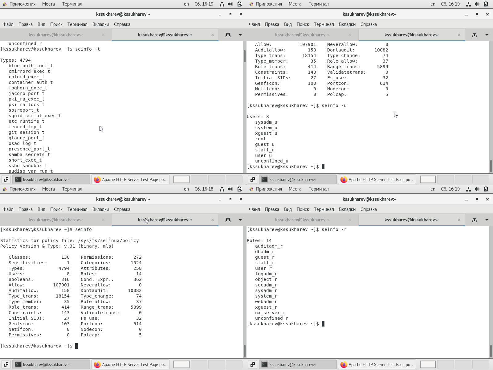
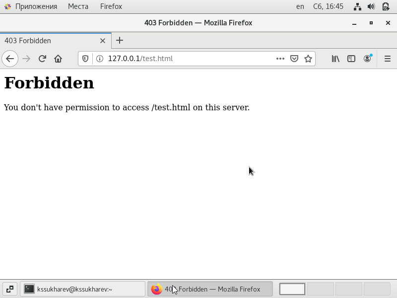
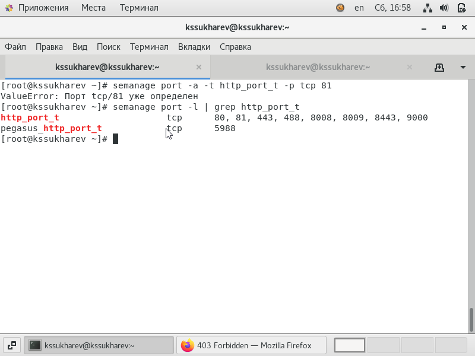
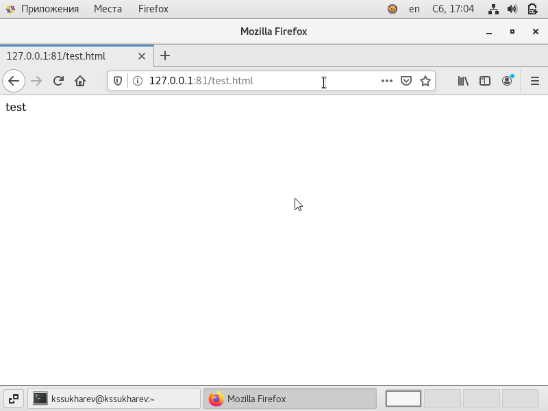

---
# Front matter
lang: ru-RU
title: "Лабораторная работа № 6"
subtitle: "Мандатное разграничение прав в Linux"
author: "Сухарев Кирилл"

# Formatting
toc-title: "Содержание"
toc: true
toc_depth: 2
lof: true
lot: true
fontsize: 12pt
linestretch: 1.5
papersize: a4paper
documentclass: scrreprt
polyglossia-lang: russian
polyglossia-otherlangs: english
mainfont: PT Serif
romanfont: PT Serif
sansfont: PT Sans
monofont: PT Mono
mainfontoptions: Ligatures=TeX
romanfontoptions: Ligatures=TeX
sansfontoptions: Ligatures=TeX,Scale=MatchLowercase
monofontoptions: Scale=MatchLowercase
indent: true
pdf-engine: lualatex
header-includes:
  - \linepenalty=10
  - \interlinepenalty=0
  - \hyphenpenalty=50
  - \exhyphenpenalty=50
  - \binoppenalty=700
  - \relpenalty=500
  - \clubpenalty=150
  - \widowpenalty=150
  - \displaywidowpenalty=50
  - \brokenpenalty=100
  - \predisplaypenalty=10000
  - \postdisplaypenalty=0
  - \floatingpenalty = 20000
  - \usepackage{float}
  - \floatplacement{figure}{H}
---

# Цель работы

Развить навыки администрирования ОС Linux. Получить первое практическое знакомство с технологией SELinux. Проверить работу SELinx на практике совместно с веб-сервером Apache.

# Условные обозначения и термины

**Утилита** -  сервисная программа, облегчающая пользование другими программами, работу с компьютером.

**Учетная запись** - хранимая в компьютерной системе совокупность данных о пользователе, необходимая для его опознавания (аутентификации) и предоставления доступа к его личным данным и настройкам.

**Директория** - объект в файловой системе, упрощающий организацию файлов.

# Теоретические вводные данные

Мандатная модель управления доступом (Mandatory Access Control, MAC) — способ разграничения доступа с фиксированным набором полномочий. Обычно настоящий MAC используется в системах с повышенным требованиями к безопасности и стоит на службе всевозможных силовых ведомств и организаций, связанных с государственной или служебной тайной. 

Модель MAC по своей сути является «электронной» реализацией бумажного «секретного» документооборота. В MAC имеются следующие «действующие лица»:

- Иерархия уровней доступа, которые обрабатываются в системе (обычно регистрируются в ОС). Для удобства часто задается в виде беззнаковых чисел (от 0 до значения, ограниченного реализацией). В этом случае для сравнения уровней доступа (выше/ниже/равно) используются простейшие арифметические операции (равно, меньше, больше).

- Объект с уровнем секретности. Любой файл, каталог в файловой системе, ячейка или запись в таблице БД, таблица в БД, сама БД, сетевой пакет и т.д. Объекту присваивается любое значение из иерархии уровней доступа. Для объекта допускается повышение уровня секретности (изменение до большего значения уровня, чем текущий). Понижение уровня секретности категорически не допускается (хотя вполне реализуемо при помощи определенных уловок).
- Субъект с уровнем доступа. Процесс какого-либо приложения либо сеанс пользователя (по сути тоже процесс приложения). Метка уровня доступа наследуется от субъекта всеми создаваемыми данным субъектом объектами. 

Значение уровня доступа субъекта или уровня секретности объекта обычно называют термином «мандатный уровень», «мандатная метка» или просто «метка» (в STCSEC данный термин называется «hierarchical classification level»). Просто, емко и почти однозначно. 

Проверка полномочий осуществляется при каждом факте доступа субъекта к объекту, защищаемому MAC. При этом мандатная модель управления доступом обычно используется совместно с другими механизмами контроля доступа, например, DAC (UNIX-моделью и POSIX ACL). При этом MAC проверяется в последнюю очередь. Сперва проверяется доступ по DAC (как наименее защищенный), а затем уже MAC.

При проверке правомочности доступа субъекта к объекту согласно мандатной модели возможны следующие комбинации:

1. *Мандатная метка субъекта равна мандатной метке объекта.* В этом случае субъекту разрешено читать и изменять объект.

2. *Мандатная метка субъекта выше мандатной метки объекта.* Субъекту разрешено только читать объект: он его видит, но не может изменить.

3. *Мандатная метка субъекта ниже мандатной метки объекта.* Субъекту формально разрешено создать объект с более высокой мандатной меткой (так называемое «повышение уровня секретности объекта»). На практике у субъекта нет технической возможности для выполнения данной операции (он просто «не видит» изменяемый объект, например, файл или каталог с файлами).

Также в MAC существует такое понятие, как «категория» (в терминологии STCSEC данный термин называется «non-hierarchical categories»). Категории в MAC являются опциональными к применению. В практике реализации MAC категории используются для «горизонтального» разграничения доступа между различными подразделениями организации. В этом случае сотрудники, несмотря на один мандатный уровень, будут получать доступ только к тем категориям объектов, к которым для них открыт доступ согласно их метке.

# Техническое оснащение и выбранные методы проведения работы

В качестве среды выполнения лабораторной работы используется менеджер виртуальных машин VirtualBox и установленная с его помощью OC Centos 7 на базе Linux.

# Выполнение работы

1. Войдем в систему под пользователем guest выполним команды **getenforce** и **sestatus**. Видим, что SELinux работает в режиме enforcing политики targeted (@fig:001).

{ #fig:001 width=100% }

2. Запустим веб-сервер командой **service httpd start** и обратимся к нему, при помощи браузера, затем проверим, что сервер работает командоа **service httpd status** (@fig:002).

{ #fig:002 width=100% }

3. Найдем веб-сервер Apache в списке процессов и определим его контекст безопасности командой **ps -eZ | grep httpd**. Получим следующий контекст system_u:system)r:httpd_t:s0 (@fig:003).

{ #fig:003 width=100% }

4. Просмотрим текущее состояние переключателей SELinux для Apache с помощью команды **sestatus -b | grep httpd**. Большинство из них находятся в положении "off" (@fig:004).

{ #fig:004 width=100% }

5. Посмотрим на статистику по политике с помощью команды **seinfo**, также определим множество пользователей (ключ **-u**), ролей (ключ **-r**), типов (ключ **-t**) (@fig:005).

{ #fig:005 width=100% } 

6. Определим тип файлов, находящихся в директории /var/www при помощи команды **ls -lZ /var/www** - httpd_sys_script_exec_t и httpd_sys_content_t (@fig:006).

{ #fig:006 width=100% } 

7. Аналогичным образом проверим директорию /var/www/html. Поскольку файлов в ней нет, то и типы определить не получится (@fig:007).

{ #fig:007 width=100% }

8. Определим круг пользователей, которым разрешено создание файлов в диреткории /var/www/html при помощи команды **ls -lZ /var/www**. Видим, что установлен пользователь system_u, что говорит о том, что создавать файлы в директории может только суперпользователь (@fig:008).

{ #fig:008 width=100% } 

9. От имени суперпользователя создадим html-файл /var/www/html/test.html (@fig:009).

{ #fig:009 width=100% } 

10. Проверим контекст созданного файла командой **ls -lZ /var/www/html**. По умолчанию созданным файлам присваивается контекст unconfined_u:object_r:httpd_sys_content_t:s0 (@fig:010).

{ #fig:010 width=100% } 

11. Обратимя к файлу через веб-сервер, введя в браузере адрес http://127.0.0.1/test.html. Файл был успешно отображен (@fig:011).

{ #fig:011 width=100% } 

12. Изучим справку командой **man httpd_selinux**. Выясняется, что контекст был выбран верно (@fig:012).

{ #fig:012 width=100% } 

13. Изменим контекст файла test.html, например на samba_share_t командой **chcon -t samba_share_t /var/www/html/test.html**. Затем командой **ls -Z /var/www/html/test.html** убедимся, что контекст изменился (@fig:013).

{ #fig:013 width=100% }

14. Попробуем еще раз получить доступ к файлу через веб-сервер. Получим ошибку (@fig:014).

{ #fig:014 width=100% }

15. Посмотрим логи командой **tail /var/log/messages** и увидим, что ошибка возникла, поскольку служба httpd не имеет доступа к выбранному нами типу файлов из-за разницы контекстов (@fig:015).

{ #fig:015 width=100% }

16. Изменим в файле /etc/httpd/httpd.conf строчку Listen 80 на Listen 81 (@fig:016).

{ #fig:016 width=100% }

17. Попробуем перезапустить веб-сервер Apache командой **service httpd restart**. Сбоя не произошло (@fig:017).

{ #fig:017 width=100% }

18. Проанализируем лог-файлы командой **tail -n1 /var/log/messages**. Видим, что сервер был успешно запущен (@fig:018).

{ #fig:018 width=100% }

19. Выполним команду **semanage port -a -t http_port_t -p tcp 81** и затем проверим, что порт 81 появился в выводе команды **semanage port -l | grep http_port_t**. Видим, что порт уже был в этом списке (@fig:019).

{ #fig:019 width=100% }

20. Попробуем запустить веб-сервер еще раз. Как и в прошлый раз, он запустился, поскольку 81 порт уже был в политике (@fig:020).

{ #fig:020 width=100% }

21. Вернем нормальный контекст командой **chcon -t httpd_sys_content_t /var/www/html/test.html**. Затем снова попробуем получить доступ к файлу через веб-сервер, введя в браузере адрес http://127.0.0.1:81/test.html (@fig:021).

{ #fig:021 width=100% }

22. Вновь вернем пот 80 в конфигурационном файле /etc/httpd/conf/httpd.conf (@fig:022).

{ #fig:022 width=100% }

23. Удалим привязку http_port_t к 81 порту командой **semanage port -d -t http_port_t -p tcp 81**. Сделать это не получится, поскольку порт определен политикой(@fig:023).

{ #fig:023 width=100% }

24. Удалим файл /var/www/html/test.html (@fig:024).

{ #fig:024 width=100% }

# Выводы

Были развиты навыки администрирования ОС Linux, получено первое практическое знакомство с технологией SELinux. Также мы проверили работу SELinx на практике совместно с веб-сервером Apache.

# Библиография

1. Мандатная модель управления доступом (MAC): обзор и применение в прикладных системах. URL: https://habr.com/ru/company/avanpost/blog/482060/ (Дата обращения: 27.11.2021).

2. Д. С. Кулябов, А. В. Королькова, М. Н. Геворкян. Информационная безопасность компьютерных сетей: лабораторные работы. // Факультет физико-математических и естественных наук. M.: РУДН, 2015. 64 с..