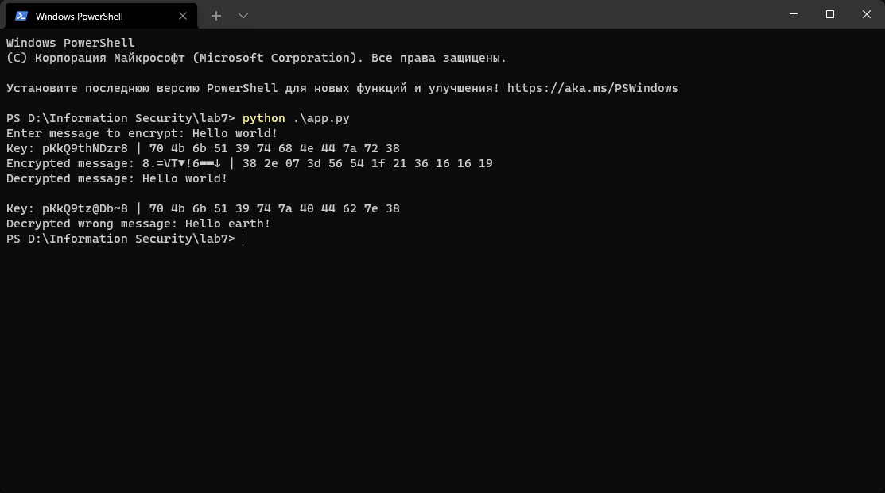

---
## Front matter
lang: ru-RU
title: "Лабораторная работа № 7"
subtitle: "Элементы криптографии. Однократное гаммирование"
author: "Сухарев Кирилл"

## Formatting
toc: false
slide_level: 2
theme: metropolis
header-includes: 
 - \metroset{progressbar=frametitle,sectionpage=progressbar,numbering=fraction}
 - '\makeatletter'
 - '\beamer@ignorenonframefalse'
 - '\makeatother'
aspectratio: 43
section-titles: true
---

# Цель работы

Освоить на практике применение режима однократного гаммирования

# Генерация ключа

    import random
    import string
    
    def generate_key(length):
      return ''.join(random.choice(string.ascii_letters + string.digits) for _ in range(length))

# Шифрование

    def single_gamming(message, key):
      return ''.join(chr(ord(m) ^ ord(k)) for m, k in zip(message, key))

    def decrypt(encrypted, key):
      return single_gamming(encrypted, key)

    def find_key(message, encrypted):
      return single_gamming(message, encrypted)

# Проверка работоспособности

{ #fig:001 width=100% }

# Листинг программы

## Листинг программы, ч. 1

    import random
    import string

    def generate_key(length):
      return ''.join(random.choice(string.ascii_letters + string.digits) \
                    for _ in range(length))
    def to_hex(input_string):
      return ' '.join('{:02x}'.format(ord(symbol)) \
                    for symbol in input_string)
    def beuatify(text):
      return "{} | {}".format(text, to_hex(text))

## Листинг программы, ч. 2

    def single_gamming(message, key):
      return ''.join(chr(ord(m) ^ ord(k)) for m, k in zip(message, key))

    def decrypt(encrypted, key):
      return single_gamming(encrypted, key)

    def find_key(message, encrypted):
      return single_gamming(message, encrypted)

## Листинг программы, ч. 3

    message = input("Enter message to encrypt: ")

    key = generate_key(len(message))
    print("Key:", beuatify(key))

    encrypted = single_gamming(message, key)
    print("Encrypted message:", beuatify(encrypted))

    print("Decrypted message:", decrypt(encrypted, key))

## Листинг программы, ч. 4

    wrong_message = "Hello earth!"
    wrong_key = find_key(encrypted, wrong_message)
    print("\nKey:", beuatify(wrong_key))
    
    print("Decrypted wrong message:", decrypt(encrypted, wrong_key))