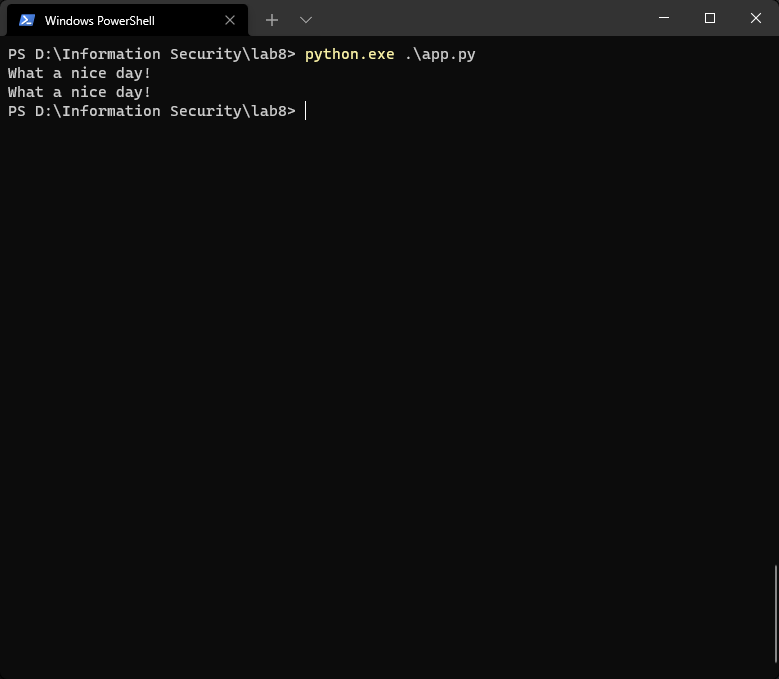

---
# Front matter
lang: ru-RU
title: "Лабораторная работа № 8"
subtitle: "Элементы криптографии. Шифрование (кодирование) различных исходных текстов одним ключом"
author: "Сухарев Кирилл"

# Formatting
toc-title: "Содержание"
toc: true
toc_depth: 2
lof: true
lot: true
fontsize: 12pt
linestretch: 1.5
papersize: a4paper
documentclass: scrreprt
polyglossia-lang: russian
polyglossia-otherlangs: english
mainfont: PT Serif
romanfont: PT Serif
sansfont: PT Sans
monofont: PT Mono
mainfontoptions: Ligatures=TeX
romanfontoptions: Ligatures=TeX
sansfontoptions: Ligatures=TeX,Scale=MatchLowercase
monofontoptions: Scale=MatchLowercase
indent: true
pdf-engine: lualatex
header-includes:
  - \linepenalty=10
  - \interlinepenalty=0
  - \hyphenpenalty=50
  - \exhyphenpenalty=50
  - \binoppenalty=700
  - \relpenalty=500
  - \clubpenalty=150
  - \widowpenalty=150
  - \displaywidowpenalty=50
  - \brokenpenalty=100
  - \predisplaypenalty=10000
  - \postdisplaypenalty=0
  - \floatingpenalty = 20000
  - \usepackage{float}
  - \floatplacement{figure}{H}
---

# Цель работы

Освоить на практике применение режима однократного гаммирования на примере кодирования различных исходных текстов одним ключом.

# Условные обозначения и термины

**Шифрование** - обратимое преобразование информации в целях сокрытия от неавторизованных лиц, с предоставлением, в это же время, авторизованным пользователям доступа к ней.

**Гаммирование** - метод симметричного шифрования, заключающийся в «наложении» последовательности, состоящей из случайных чисел, на открытый текст.

**Случайная величина** - в теории вероятностей, величина, принимающая в зависимости от случая те или иные значения с определёнными вероятностями.

# Теоретические вводные данные

Предложенная Г. С. Вернамом так называемая «схема однократного использования (гаммирования)» (рис. 7.1) является простой, но надёжной схемой шифрования данных.

Гаммирование представляет собой наложение (снятие) на открытые (зашифрованные) данные последовательности элементов других данных, полученной с помощью некоторого криптографического алгоритма, для получения зашифрованных (открытых) данных. Иными словами, наложение гаммы — это сложение её элементов с элементами открытого (закрытого) текста по некоторому фиксированному модулю, значение которого представляет собой известную часть алгоритма шифрования.

В соответствии с теорией криптоанализа, если в методе шифрования используется однократная вероятностная гамма (однократное гаммирование) той же длины, что и подлежащий сокрытию текст, то текст нельзя раскрыть. Даже при раскрытии части последовательности гаммы нельзя получить информацию о всём скрываемом тексте.

Открытый текст имеет символьный вид, а ключ — шестнадцатеричное представление. Ключ также можно представить в символьном виде, воспользовавшись таблицей ASCII-кодов. К. Шеннон доказал абсолютную стойкость шифра в случае, когда однократно используемый ключ, длиной, равной длине исходного сообщения,является фрагментом истинно случайной двоичной последовательности с равномерным законом распределения. Криптоалгоритм не даёт никакой информации об открытом тексте: при известном зашифрованном сообщении $С$ все различные ключевые последовательности $K$ возможны и равновероятны, а значит, возможны и любые сообщения $P$.

Необходимые и достаточные условия абсолютной стойкости шифра:

– полная случайность ключа;

– равенство длин ключа и открытого текста;

– однократное использование ключа.

# Техническое оснащение и выбранные методы проведения работы

В качестве языка программирования для написания приложения был выбран Python версии 3.9.

# Выполнение работы

1. При выполнении работы воспользуемся кодом, описанным в предыдущей лабораторной работы, убрав из него ненужные фрагменты.

*Листинг 1. Функция генерации ключа и гаммирования*

    import random
    import string

    def generate_key(length):
      return ''.join(random.choice(string.ascii_letters + string.digits) \
                    for _ in range(length))

    def single_gamming(message, key):
      return ''.join(chr(ord(m) ^ ord(k)) for m, k in zip(message, key))

2. Данная программа вполне справляется с шифрованием сразу нескольких сообщений одним и тем же ключом, что видно в скринкасте к данной работе. Основной же целью этой работы является нахождения способа прочитать оба сообщения, не зная ключа. В случае с однократным гаммированием нам нужно лишь получить одно из исходных сообщений. Выполнив однократное гаммирование к нему и к результату гаммирования двух шифротекстов, мы получим второе сообщение. Данный алгоритм выражен в Листинге 2.

*Листинг 2. Расшифровка неизвестного текта по известному*

    visible = "You are at home!"
    hidden = "What a nice day!"
    key = generate_key(25)
    encrypted1 = single_gamming(visible, key)
    encrypted2 = single_gamming(hidden, key)
    prediction = single_gamming(single_gamming(encrypted1, encrypted2), visible)
    print(hidden)
    print(prediction)

4. В результате программы видем, что отгаданный текст совпал с реальным (@fig:001).

{ #fig:001 width=100% }

# Контрольные вопросы

1. Как, зная один из текстов (P1 или P2), определить другой, не зная при этом ключа?

Нужно сложить по модулю два оба шифротекста, полученный результат сложить по модулю два с одним из начальных текстов. Таким образом получится второй начальный текст.

2. Что будет при повторном использовании ключа при шифровании текста?

Два текста получатся взаимосвязанными, что плохо скажется на безопасности шифрования.

3. Как реализуется режим шифрования однократного гаммирования одним ключом двух открытых текстов?

Каждый текст отдельно гаммируется одним и тем же ключом.

4. Перечислите недостатки шифрования одним ключом двух открытых текстов.

Увеличивается шанс взлома, т.к. зная один исходный текст, можно получить второй, при этом не нужно знать ключ.

5. Перечислите преимущества шифрования одним ключом двух открытых текстов.

Уменьшение затрат при передаче ключей.

# Выводы

Было освоено на практике применение режима однократного гаммирования

# Библиография

1. Использование однократного гаммирования. URL: https://www.arhivinfo.ru/1-15068.html (Дата обращения: 11.12.2021).

2. Д. С. Кулябов, А. В. Королькова, М. Н. Геворкян. Информационная безопасность компьютерных сетей: лабораторные работы. // Факультет физико-математических и естественных наук. M.: РУДН, 2015. 64 с..